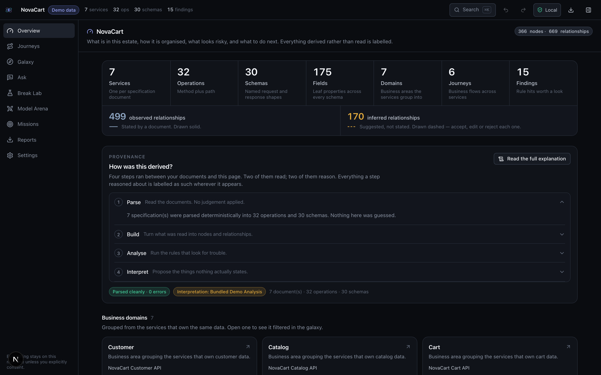
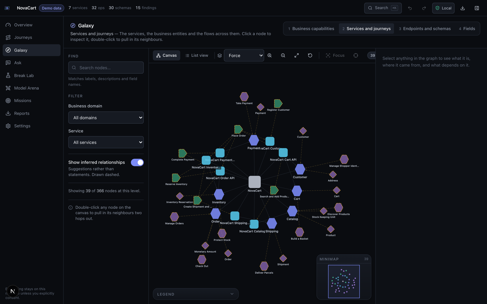
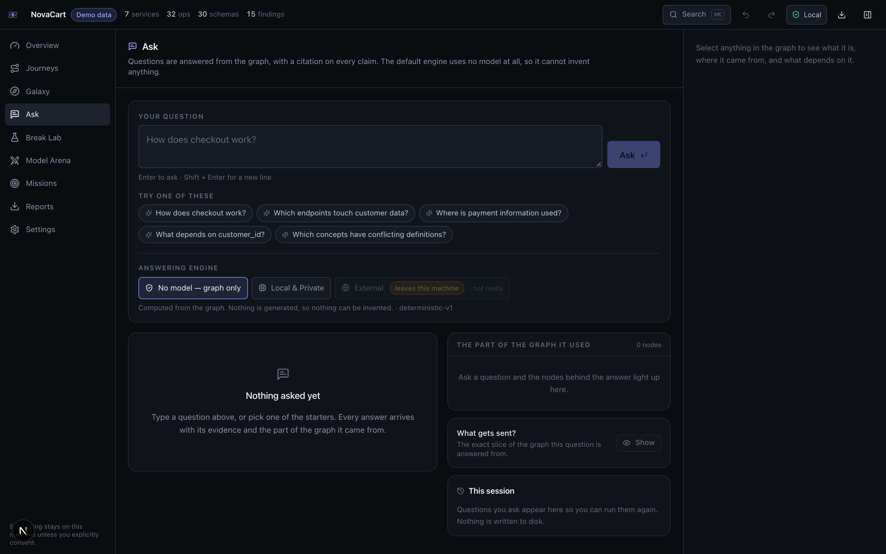
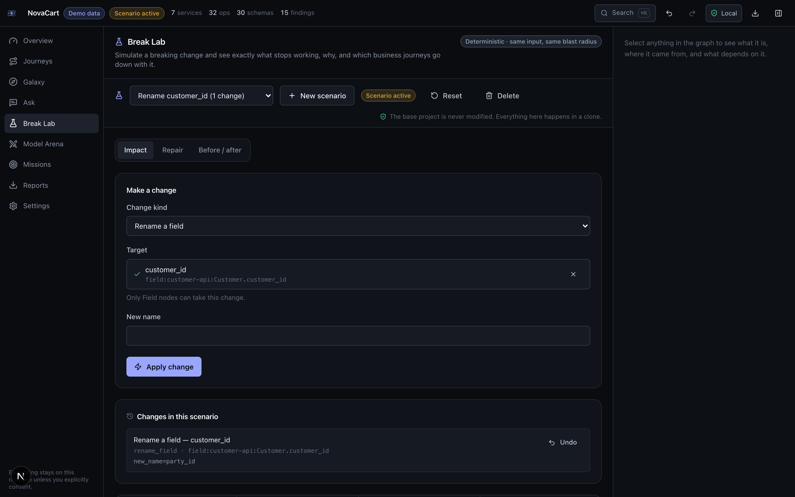

<div align="center">

# 🌌 API Galaxy

### Drop your API. Watch it come alive. Ask how it works. Break it before production does.

Turn OpenAPI specifications into a living, evidence-backed model of an API estate —
one you can explore, question, safely break, repair, compare across models, and share.

**No account. No API key. No cloud. Ollama by default, and fully useful with no model at all.**

[](#privacy)
[](https://ollama.com)
[](#tests)
[](#exports)
[](#prerequisites)
[](LICENSE)

*The Sunday Builds*

</div>

---

<div align="center">

<p><em>Seven specification files became seven business domains. 499 relationships the documents state, 170 the product inferred — counted separately, never merged.</em></p>
</div>

---

## The idea

You have been handed an API estate you did not write. Seven services, thirty-two
endpoints, a hundred and seventy-five fields. Somewhere in there, three services call the
same customer three different things, one endpoint hands out personal data with no
authentication, and renaming one field would take down checkout.

A chat assistant can summarise the file. It cannot show you what breaks.

API Galaxy parses your specifications deterministically, builds a graph where **every node
and edge records the file and JSON Pointer it came from**, computes what depends on what,
and then — and only then — uses a language model to add business meaning on top, clearly
labelled as inference.

Then you can break it, on a clone, and watch the blast radius.

## What this actually is

**It reads your OpenAPI files, turns the whole estate into one queryable graph, and tells
you what a change would break.**

Three questions people reasonably ask first:

- **Is it an ontology tool?** Yes — see [below](#yes-it-is-an-ontology-and-it-runs-on-your-machine).
  It is a local-first ontology of your API estate, with provenance on every assertion.
- **Is it a graph of my repository?** No. It never opens a `.py`, `.ts` or `.java` file.
  It reads **specification documents only**.
- **So it just turns a JSON file into a graph?** Essentially — but the value is in loading
  **many files at once**. One spec describes one service; the findings that matter live
  *between* files. Three of the eight findings in [`samples/try-it`](samples/try-it/) do
  not exist if you import its two files separately.

## The input is always an OpenAPI document

There is exactly one kind of input. Everything else is a converter that produces it.

| Path | What it accepts | Notes |
| --- | --- | --- |
| **Upload / drop** | `.json`, `.yaml`, `.yml` — OpenAPI **3.0 or 3.1** | Several files at once, 12 MB each |
| **Paste** | The same, as text | Validated as you type, with the failing line |
| **Manifest** | `kind: EstateManifest` listing many spec files | How `samples/novacart` loads its seven services |
| **Postman** | Collection v2.x | **Beta.** Converted to OpenAPI first, and recovers only paths, methods, names and folder-as-tag — Postman has no schema language, so there is nothing else to recover |
| **URL** | — | **Disabled in this build.** The SSRF-safe fetcher exists and is off |

Not accepted, by design: source code, running traffic, databases, GraphQL, gRPC/protobuf,
AsyncAPI, WSDL. If your API is not described by an OpenAPI document, this tool has nothing
to read.

## Yes, it is an ontology, and it runs on your machine

Presenting this as an ontology is accurate, provided you are precise about which kind.

### What makes it one

**A declared vocabulary.** 18 classes and 17 predicates, fixed in code, not inferred per
project:

```
Classes     Estate · Domain · Service · Server · APIOperation · Endpoint · Schema ·
            Field · SecurityScheme · BusinessEntity · Capability · Journey ·
            JourneyStep · Risk · Scenario · Change · Repair · Evidence

Predicates  CONTAINS · EXPOSES · USES_REQUEST · RETURNS · REFERENCES ·
            REQUIRES_SECURITY · BELONGS_TO_DOMAIN · REPRESENTS · CALLS_OR_PRECEDES ·
            PART_OF_JOURNEY · DEPENDS_ON · ALIAS_OF · CONTAINS_PII · AFFECTS ·
            BREAKS · REPAIRED_BY · INFERRED_RELATION
```

**Stable, content-derived identifiers.** The same document always yields the same IRIs, so
two runs are diffable and a report can be regenerated and compared:

```
urn:api-galaxy:node:schema:customer-api:Address
```

**A namespace and a real serialisation.** `https://api-galaxy.local/ns#`, exported as
JSON-LD — 1,073 objects for the bundled estate — plus GraphML for Gephi, yEd and Cytoscape.

**An epistemic layer, which is the unusual part.** Most ontologies record *what is true*.
This one also records *how well you know it*: six source kinds, five acceptance states,
and one derived **standing** — `stated`, `accepted`, `suggested`, `rejected` — that drives
the stroke on the canvas, the graph filter and the impact scoring from a single definition.
`Order.cust_no ALIAS_OF Customer.customer_id` is in the graph as a **suggestion**, and it
never silently becomes a fact.

**It is entirely local.** `~/.api-galaxy` — an SQLite file, one graph snapshot per project,
and your exports. No server, no account, no telemetry.

### What it is not

Say this before a semantic-web specialist says it for you:

| | |
| --- | --- |
| ❌ OWL / RDFS | No class axioms, no `subClassOf`, no cardinality restrictions |
| ❌ A reasoner | No description-logic entailment, no consistency checking |
| ❌ A triple store / SPARQL | NetworkX in memory, JSON snapshots on disk |
| ❌ A shared vocabulary | `api-galaxy.local` is ours; it does not align to schema.org |

What this project calls *inference* is **rules plus a language model**, not logical
entailment. `ALIAS_OF` comes from identifier stems, abbreviation and reading field
descriptions — not from an axiom a reasoner discharged.

### The accurate one-liner

> A **typed property graph with a declared vocabulary and provenance on every edge** — a
> domain ontology in the engineering sense, materialised locally. Not OWL, no reasoner.

### Which framing to lead with

Both are true. Pick by who is in the room:

- **Architects, data and governance, presales** — lead with the ontology. It is the
  credibility signal, and the provenance layer is the part they will not have seen before.
- **Engineers shipping a change today** — lead with the outcome: *it tells you what your
  rename breaks, and cites the file and line for every claim.*

The ontology is **why** the second sentence can be true. Do not let the word do the work of
the demo, and do not claim formal semantics this does not have.

### Ten things people use it for

1. **Inherit an estate** — get the domain map of seven unknown services in a minute rather than a week of reading YAML.
2. **Pre-merge breaking-change review** — rename a field, see exactly which endpoints and business journeys stop working.
3. **Find one concept under many names** — `customer_id` / `cust_no` / `party_key` are one person, and no single file says so.
4. **Security sweep** — find endpoints that return personal data with no authentication.
5. **Consistency audit** — mismatched error envelopes, three pagination styles, money that is a number here and a string there.
6. **Architecture review** — service coupling, circular dependencies, whether the domain boundaries are real.
7. **Migration and modernisation assessment** — produce a client-ready estate report as the actual deliverable.
8. **Evidence in an API design review** — attach a scoped diagram or a Markdown section to the PR instead of an opinion.
9. **Onboard engineers** — journey playback and missions teach the estate by using it.
10. **Decide whether a model earns its place** — the Arena measures recall *and* invented references on your own specs.

### Where it sits in the lifecycle

| Phase | Helps? |
| --- | --- |
| Design and API review | ✅ core |
| Pre-merge review | ✅ core — this is the impact answer |
| Release planning | ✅ what to announce, what to deprecate |
| Onboarding | ✅ |
| Assessment and pre-sales | ✅ the report *is* the deliverable |
| Build, CI, deploy | ❌ not a build tool |
| Runtime, monitoring, incident response | ❌ it sees no traffic |

### Is it a production deliverable?

Two different things, and it matters which you mean:

- **The app** is a workbench. You run it locally; it is not a service you deploy.
- **The report** is the deliverable — self-contained HTML or PDF, carrying a specification
  fingerprint and a fact-versus-inference legend, that you hand to a client or attach to
  a ticket.

### Where it honestly does not help

- If your specifications are stale, the graph is stale. It believes the documents.
- It cannot see undocumented consumers, so real blast radius may be wider than it reports.
- It will not find a bug in your implementation — only in your contracts.

> **The short version:** before you merge a specification change, find out what it breaks
> across every other service, with a citation for each claim.

## What makes this different from a chatbot or a Swagger viewer

| | Swagger UI | A chat assistant | API Galaxy |
| --- | :---: | :---: | :---: |
| Renders your endpoints | ✅ | — | ✅ |
| Explains them in business terms | — | ✅ | ✅ |
| Persists as a navigable model | — | — | ✅ |
| Cites a file and line for every claim | — | — | ✅ |
| Separates fact from inference | — | — | ✅ |
| Computes cross-service dependencies | — | — | ✅ |
| Tells you what a rename breaks | — | — | ✅ |
| Proves the repair worked | — | — | ✅ |
| Compares two models on your own data | — | — | ✅ |
| Works with no model at all | ✅ | — | ✅ |

The line that matters: **an LLM is never allowed to state a fact about your API.** Facts
come from the parser. The model adds meaning, and everything it adds is drawn dashed until
a person accepts it.

---

## Quick start

```bash
git clone <your-fork> api-galaxy && cd api-galaxy
# Python venv + node modules (~2 min)
make setup
# starts both servers and loads the sample estate
make demo
```

Open **http://127.0.0.1:3000** and click **Explore the demo galaxy**.

That is the whole setup. No model, no key, no network required — the bundled NovaCart
estate ships with a precomputed semantic layer so the demo is complete offline.

<details>
<summary><b>Prefer to run the pieces separately?</b></summary>

```bash
# FastAPI on :8099  → http://127.0.0.1:8099/api/docs
make dev-api
# Next.js on :3000
make dev-web
# what is installed, what optional pieces are missing
make doctor
```
</details>

### Prerequisites

| | Version | Notes |
| --- | --- | --- |
| **Python** | 3.11 – 3.13 | 3.12 recommended. `uv` is used if present, `venv` otherwise. |
| **Node** | 20+ | 22 recommended. |
| **Ollama** | any | **Optional.** Everything works without it. |

<details>
<summary><b>Platform notes</b></summary>

**macOS** — for the PDF and PNG exports you also need the Cairo and Pango libraries:
```bash
brew install cairo pango gdk-pixbuf libffi
```
Homebrew installs these into `/opt/homebrew/lib`, which Python's library loader does not
search by default. API Galaxy extends `DYLD_FALLBACK_LIBRARY_PATH` itself at import, so
this works with no further configuration.

**Linux (Debian/Ubuntu)**
```bash
sudo apt install libpango-1.0-0 libpangoft2-1.0-0 libcairo2 libgdk-pixbuf-2.0-0
```

**Windows** — the app itself runs fine. WeasyPrint needs GTK, which is fiddly; if you skip
it, the PDF format reports itself unavailable and the **Print-ready HTML** export plus your
browser's *Print to PDF* is the documented alternative. Use `py -3.12 -m venv .venv` and run
the `make` targets' commands directly, or use WSL.

**Docker** — `docker compose up --build` is provided as a convenience, not the primary
path. It deliberately does not containerise Ollama; it points at the one on your host.
</details>

---

## Features

### Explore
The graph starts at business capabilities, not at a hairball of endpoints. Four semantic
zoom levels — capabilities → services and journeys → endpoints and schemas → fields — plus
pan, zoom, fit, search, domain and service filters, four layouts, neighbour expansion on
double-click, focus mode, and a minimap.

Every canvas has a real, focusable **list view** beside it, because a canvas is invisible
to a screen reader.

<div align="center">

</div>

### Ask
Natural language in, **graph out**. "How does checkout work?" lights the real path through
cart, order, inventory and payment, with a citation on every hop.

The model may only reference node IDs it was actually shown. Anything it invents is
discarded before you see it — and counted, and reported.

<div align="center">

</div>

### Break
Rename a field. Remove an endpoint. Take a service down. The Break Lab clones the graph —
**the base project is never modified** — and computes impact deterministically:

- **Broken** — directly consumes the changed contract
- **Degraded** — still type-checks, but the meaning moved
- **Possibly affected** — reached only through weaker evidence
- **Unaffected**

Each row carries the dependency chain that explains it, and the journeys that stop working.

<div align="center">

</div>

### Repair
Deterministic repairs come from the change itself; a model can add semantic ones. Accept,
edit or reject each, then replay the journey.

**"Journey restored" appears only after validation actually passes.** It is a result, never
an assumption — there is a test asserting exactly that.

### Compare
Send the same bounded context, the same prompt version and the same response schema to
Ollama and Kimi, and compare: consensus, disagreement, direct conflict, **hallucinated
references**, latency, tokens and cost. You decide which answer becomes part of the model,
and the decision goes to an append-only log with the provider, model and prompt version
that produced it.

### Missions
Five short challenges that teach the product by using it — find the hidden dependency, stop
the data leak, survive the rename, untangle the twins, diagnose a chaos run. Graded against
the real graph, never against a stored answer key.

### Exports

| Format | What it is |
| --- | --- |
| **Interactive HTML** | **The flagship.** A single self-contained file with search, filters, pan/zoom, a node inspector and journey playback. No backend, no API key, no internet, no CDN. |
| PDF | A static assessment report: cover, contents, inventory, domains, journeys, risks, impact, methodology, limitations. |
| Print-ready HTML | The same document for your browser's *Print to PDF*. |
| SVG / PNG | Vector and raster diagrams at 1×, 2× and presentation resolution. |
| Mermaid | Editable flowcharts and journey sequence diagrams. |
| JSON-LD | The ontology, with provenance and confidence preserved. |
| GraphML | For Gephi, yEd, Cytoscape Desktop. |
| CSV bundle | Nodes, edges, risks, journeys, decisions, metadata. |
| Markdown | Repository- and Confluence-friendly. |

Every export can be scoped to the whole project, one journey, one domain, an impact
scenario, or your current selection — and every one carries the project name, generation
time, specification fingerprint, app version, active scenario, provider disclosure and the
fact-versus-inference legend.

---

## Architecture

```
┌─────────────────────────── your machine ───────────────────────────┐
│                                                                     │
│   apps/web  ·  Next.js 15 + React 19 + Tailwind 4                   │
│   landing · import · overview · galaxy · journeys · ask              │
│   break lab · arena · missions · reports · settings                  │
│        │  Cytoscape.js graph canvas + accessible list view           │
│        ▼  /api/* proxied to the backend                              │
│                                                                     │
│   apps/api  ·  FastAPI + Pydantic                                   │
│                                                                     │
│     parse          OpenAPI 3.0/3.1 · safe $ref · cycles · diagnostics│
│       ▼                                                              │
│     build          nodes + edges, each with file and JSON Pointer     │
│       ▼                                                              │
│     analyse        15 rules · PII · aliases · journeys · impact       │
│       ▼                                                              │
│     interpret      Deterministic | Ollama | Kimi   ← the only         │
│       ▼                          (labelled, dashed)   optional part   │
│     export         one ReportBundle → 10 formats                      │
│                                                                     │
│   SQLite (projects, scenarios, decisions)  ·  JSON files (graphs)    │
└─────────────────────────────────────────────────────────────────────┘
                                  ╎
                   only with your explicit, per-project consent
                                  ╎
                        ┌─────────▼─────────┐
                        │  external model   │
                        │  (sanitised)      │
                        └───────────────────┘
```

Design decisions are recorded in [`docs/architecture/`](docs/architecture/):
[graph library](docs/architecture/adr-001-graph-library.md) ·
[providers](docs/architecture/adr-002-provider-abstraction.md) ·
[provenance](docs/architecture/adr-003-provenance.md) ·
[exports](docs/architecture/adr-004-exports.md) ·
[storage](docs/architecture/adr-005-storage-and-design-system.md)

Presenting it? [`docs/demo-runbook.md`](docs/demo-runbook.md) is the presenter's script —
what to click, what to say, the verified numbers, and the questions you will get.

---

## Privacy

**Nothing leaves your machine unless you approve it, and you see what would go first.**

- Ollama is the default; the app is fully useful with no model at all.
- External providers are off until you add a key, and there is a master switch that
  disables them entirely — turning it off also clears every consent you have given.
- Before the first external request for a project you get a preview of the exact payload,
  with credentials, emails, phone numbers, card numbers, internal URLs and example values
  already stripped.
- Consent is **per project**, and revocable.
- The decision log records the provider, model, prompt version and a payload fingerprint —
  never the payload, never a secret.
- No telemetry. No analytics. No update check. There is no server to phone home to.

Full detail, including every redaction rule: [`docs/privacy.md`](docs/privacy.md).

Your data lives in `~/.api-galaxy` as plain files. Delete the directory and the app has
forgotten you.

---

## Using a local model

Everything above works with no model. To add the AI layer:

```bash
# ~2.5 GB, the tested default
ollama pull qwen3:4b
```

Then Settings → the Ollama card should read **Ready**, and Ask gains a **Local & Private**
provider.

`qwen3:4b` is the default for a measured reason: with thinking enabled, Ollama returns the
content in a separate `thinking` field and leaves `response` empty, so a caller silently
sees nothing. API Galaxy sends `think: false` and falls back to reading `thinking` anyway.

Larger models work and are better at journeys and aliases. `qwen2.5:7b-instruct` and
`llama3.1:8b` are both reasonable. **Nothing is downloaded for you** — you choose the model
and pull it yourself.

### Optional: an external model

Settings → Providers → add a Kimi API key. It goes to your OS keychain if `keyring` is
installed, otherwise it is held in memory for the session only, and Settings tells you
which. ⚠️ Using it sends the sanitised, previewed payload to a third party over the
internet. Everything else stays local.

---

## The sample estate

`samples/novacart/` is a fictional seven-service e-commerce estate — 32 operations, 30
schemas, 175 fields — built to contain **nine deliberate, documented problems**:

| # | Problem | Where |
| --- | --- | --- |
| 1 | `customer_id` / `cust_no` / `party_key` are the same person | customer, order, payment |
| 2 | An unauthenticated endpoint returns personal data | `GET /public/customers/{id}/summary` |
| 3 | Checkout carries a customer identifier across three services | cart → order → payment |
| 4 | Two different error envelopes | `Error` vs `ProblemResponse` |
| 5 | A money value is a number on one side and a decimal string on the other | order ↔ payment |
| 6 | A deprecated endpoint is still the documented path | `POST /carts/{id}/checkout` |
| 7 | A circular dependency between two services | order ↔ inventory |
| 8 | Three different pagination conventions | page/size, limit/offset, cursor |
| 9 | A relationship only a semantic reader can find | shipping `destination` ↔ customer `Address` |

All nine are detected. Eight by deterministic rules, and the ninth — by design — only by
the semantic layer. See [`samples/novacart/README.md`](samples/novacart/README.md).

### Testing the import path

NovaCart loads through a built-in button, which does not exercise the drop zone. For that
there is a second, much smaller pair of specs in
[`samples/try-it/`](samples/try-it/README.md) — a pet boarding business, 8 operations,
seeded with eight problems.

Drag both files onto **Import your API** at once. Three of the eight findings only exist
*between* the two services, so importing them one at a time hides them:

```
high    'amount' has different types in different services
high    Sensitive data exposed without authentication
medium  'owner' is spelled 2 different ways  (owner_id vs party_ref)
medium  Circular dependency between billing-api and booking-api
```

Then rename `Booking.owner_id` in the Break Lab and watch `party_ref` — in the *other*
service — show up in the broken list. That is the class of breakage code review misses.

---

## Tests

```bash
# everything
make test
# 222 pytest tests: unit + API integration
make test-api
# TypeScript + ESLint
make test-web
# Playwright, needs both servers running
make e2e
# what CI runs
make check
```

Current state, on this machine:

```
222 passed, 1 skipped          pytest
0 errors                       tsc --noEmit
0 errors                       eslint
0 console errors               across all 11 screens in a real browser
10 / 10                        export formats render
```

The one skip is a test asserting that PDF export *fails honestly* without WeasyPrint —
correctly inverted, because WeasyPrint is installed here.

Tests assert behaviour a user would notice. Among other things: that every node carries
provenance, that a proposed edge never renders as a stated fact, that a scenario never
mutates the base graph, that an answer citing a non-existent node is marked ungrounded,
that each of the nine sample defects is found, and that "journey restored" only appears
when validation passes.

---

## Troubleshooting

<details>
<summary><b>"Could not reach the API Galaxy backend"</b></summary>

The Python server is not running. `curl http://127.0.0.1:8099/api/v1/health`, then
`make dev-api`. If the port is taken, `API_GALAXY_PORT=8100 make dev-api` and set
`NEXT_PUBLIC_API_URL` to match.
</details>

<details>
<summary><b>PDF or PNG export is greyed out</b></summary>

Those need system libraries. The reason is shown next to the format. Install them (see
*Platform notes*) and restart the backend, or use **Print-ready HTML** with your browser's
*Print to PDF*. The app will never silently substitute a different artifact.
</details>

<details>
<summary><b>Ollama says "unreachable" or "not pulled"</b></summary>

`ollama serve` to start it; `ollama pull qwen3:4b` for the model; `ollama list` to see what
you have. If your model has a different name, set it in Settings — no restart needed.
</details>

<details>
<summary><b>The graph is slow or cluttered</b></summary>

Drop to a lower semantic zoom level, or filter to one domain. A view is capped at 5,000
nodes and tells you when it has truncated. Level 1 is a dozen boxes by design.
</details>

<details>
<summary><b>An answer looks wrong</b></summary>

Click the evidence. Every claim links to a file and a JSON Pointer. If an answer is marked
*not grounded*, the model cited nothing real and you should not trust it — that banner is
the product working, not failing.
</details>

<details>
<summary><b>My specification will not import</b></summary>

The import screen reports the exact line and column. Swagger 2.0 is not supported — convert
with `swagger2openapi` first. Postman collections import as a beta path and recover only
paths, methods and names, because Postman has no schema language.
</details>

<details>
<summary><b>I want to start over</b></summary>

Settings → *Clear all local data*, or delete `~/.api-galaxy`. `make demo-reset` removes just
the demo project.
</details>

---

## Limitations

Stated plainly, because a tool that overstates itself is worse than one that does less.

- **Impact analysis is a statement about the specification graph, not a prediction about
  production.** It cannot see undocumented consumers, and tolerant clients may absorb
  changes it reports as breaking.
- **Alias detection, PII classification, pagination and naming consistency are
  heuristics.** They are labelled *heuristic* everywhere they appear. They will have false
  positives.
- **Small local models are weaker at journeys and aliases** than the bundled analysis. The
  Model Arena exists so you can measure that rather than take my word for it.
- **Latency and outage simulation model reachability only** — no queueing, no retries, no
  partial failure.
- **Mission progress is not saved** between sessions.
- **Remote `$ref` fetching is not implemented**, only guarded. URL import is likewise not
  exposed in this build; the import screen says so rather than offering a dead control.
- **Postman import is shallow** by necessity.
- **One theme.** Dark, done properly, rather than two done half-way.
- Tested on macOS with Python 3.12 and Node 22+. Linux should be identical; Windows is
  untested beyond the app itself running.

## Roadmap — *not* implemented

Listed separately so nothing here reads as shipped:

- Kùzu or Neo4j behind the existing `GraphRepository` interface, for estates of 10,000+ nodes
- Live traffic sampling to confirm which documented dependencies are real
- Git-aware diffing: import two revisions and see the change impact between them
- gRPC, GraphQL and AsyncAPI ingestion
- Multi-user mode with real authentication
- Scheduled re-analysis with drift alerts

---

## Contributing

See [`CONTRIBUTING.md`](CONTRIBUTING.md). The six non-negotiable rules are at the top, and
they are the product rather than style preferences.

Security issues: [`SECURITY.md`](SECURITY.md).

## Licence

MIT — see [`LICENSE`](LICENSE). ⚠️ **Repository owner:** the licence file contains a
placeholder copyright line. Confirm MIT is what you want and put your name on it before
publishing.

---

<div align="center">

**The Sunday Builds**

*Solving Real Problems Using Free AI, Every Sunday!*

</div>
